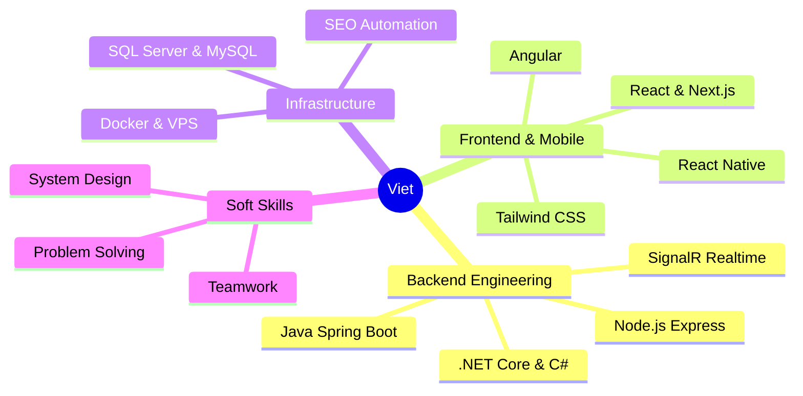

<div align="center">

# 👋 Welcome to My Digital Workspace


<p align="center">
  <a href="https://bui-xuan-viet-fullstack-developer.vercel.app/"></a>
  <a href="mailto:vietbx23@gmail.com"></a>
  <a href="https://github.com/VietBx23"></a>
  
</p>

</div>

---

## 🎯 About Me

```typescript
const viet = {
  location: "Ho Chi Minh City, Vietnam 🇻🇳",
  education: "FPT Polytechnic - Software Applications (GPA: 8.9/10)",
  currentRole: "Full Stack Developer @ THIEN CO TRI LIEN",
  experience: "2+ years in Fullstack Development",
  specialization: [
    "Backend Systems (.NET/Java)",
    "Web Development",
    "Automated SEO Tools",
  ],

  achievements: {
    users: "10,000+ EV users managed",
    stations: "50+ Charging Stations monitored in Real-time",
    optimization: "Automated Content CMS reducing manual work",
    performance: "Sub-second latency with SignalR",
  },

  currentlyLearning: ["Cloud Architecture", "System Design", "Advanced DevOps"],
  openToWork: true,

  motto: "Clean Architecture for Scalable Solutions 🚀",
};
```

<div align="center">

### 💼 **Backend Specialist** | 🎓 **High Performance Coder** | ⚡ **Problem Solver**

</div>

---

## 🛠️ Tech Arsenal

<details open>
<summary><b>� Languages & Core</b></summary>
<br>

<p>
  
  
  
  
  
  
</p>

</details>

<details open>
<summary><b>⚙️ Backend & Database</b></summary>
<br>

<p>
  
  
  
  
  
  
  
</p>

</details>

<details open>
<summary><b>🌐 Frontend & Mobile</b></summary>
<br>

<p>
  
  
  
  
  
  
</p>

</details>

<details open>
<summary><b>🔧 DevOps & Tools</b></summary>
<br>

<p>
  
  
  
  
</p>

</details>

---

## � Professional Journey

<table>
<tr>
<td width="50%">

### 🚀 THIEN CO TRI LIEN CO., LTD

**Full Stack Developer** • _2025 - Present_

```diff
+ Built Automation CMS with Node.js & PHP
+ Developed Python tools for SEO Optimization
+ Managed VPS deployments via Baota Panel
+ Optimized database performance for scale
```

</td>
<td width="50%">

### � SOLAR EV COMPANY

**IT Engineer** • _06/2024 - 06/2025_

```diff
+ Built EV Platform for 10,000+ users (.NET Core)
+ Implemented Real-time SignalR Monitoring
+ Developed React Native Mobile App (Cross-platform)
+ Managed IoT Charger configurations/firmware
```

</td>
</tr>
</table>

---

## 🌟 Featured Projects

<div align="center">

### 🔋 EV Charging Station Platform

_Backend & Platform Developer_

<p>
  
  
  
  
</p>

> 🎯 Comprehensive infrastructure management for 50+ EV Chargers
>
> ⚡ **Real-time** WebSocket monitoring & Remote Control capability
>
> 💳 Integrated Multi-payment support & Performance Analytics

</div>

<br>

<div align="center">

### 📱 SolarEV Mobile App

_Mobile Developer_

<p>
  
  
  
  
</p>

> 🗺️ Visual Station Locator with dynamic routing
>
> 💰 E-wallet integration for seamless charging payments
>
> 📱 Cross-platform support (iOS & Android)

[🔗 Android App](https://play.google.com/store/search?q=solarev&c=apps) • [🔗 iOS App](https://apps.apple.com/vn/app/solarev-tr%E1%BA%A1m-s%E1%BA%A1c-xe-%C4%91i%E1%BB%87n/id6470471363)

</div>

<br>

<div align="center">

### 🤖 AI Content & SEO Suite

_Full Stack Developer_

<p>
  
  
  
</p>

> ⚡ Automated Article Generation using AI
>
> 🔍 Google Sites Content Optimization
>
> 🎨 Modern Portfolio Generator

[🔗 View Tool](https://quickly-create-articles.vercel.app/)

</div>

---

## � GitHub Analytics

<div align="center">
  
  
</div>

<div align="center">
  
</div>

---

## 🏆 Education & Achievements

<div align="center">

|     🎯 Metric      |        📈 Achievement        |
| :----------------: | :--------------------------: |
| **Platform Users** |     10,000+ Active Users     |
|   **Education**    | FPT Polytechnic (GPA 8.9/10) |
|   **Experience**   |      2+ Years Fullstack      |
|   **Tech Stack**   |       .NET, Java, MERN       |

</div>

---

## 💡 What I Bring to the Table

<div align="center">



</div>

---

## 📫 Let's Connect!

<div align="center">

<a href="https://bui-xuan-viet-fullstack-developer.vercel.app/">
  
</a>
<a href="mailto:vietbx23@gmail.com">
  
</a>
<a href="https://github.com/VietBx23">
  
</a>

<br><br>

📍 **Location:** Ho Chi Minh City, Vietnam
<br>
📱 **Phone:** +84 932 718 625

---

### 💭 _"Code is poetry written for machines."_


</div>

<div align="center">
  
⭐️ **If you find my work interesting, consider giving a star!** ⭐️

_© 2025 Bui Xuan Viet_

</div>
